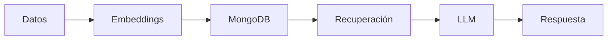

# Sistema RAG NoSQL con MongoDB

**Asignatura:** Bases de Datos No Relacionales  
**Tipo:** Proyecto Final

---

## 📋 Índice

- [Información General](#-información-general)
- [Objetivos de Aprendizaje](#-objetivos-de-aprendizaje)
- [Infraestructura](#️-infraestructura)
- [Alcance Técnico Mínimo](#-alcance-técnico-mínimo)
- [Entregas del Proyecto](#-entregas-del-proyecto)
- [Casos de Prueba Obligatorios](#-casos-de-prueba-obligatorios)
- [Tecnologías Recomendadas](#-tecnologías-recomendadas)

---

## 📖 Información General

### Descripción

Los estudiantes desarrollarán un **sistema de Recuperación y Generación Aumentada (RAG)** utilizando MongoDB como base de datos principal. El sistema aprovechará las capacidades NoSQL de MongoDB para almacenar documentos flexibles, implementar búsqueda vectorial mediante **Atlas Vector Search** y construir un pipeline RAG completo que integre un LLM accesible mediante API gratuita.

El proyecto combina el modelado flexible de documentos NoSQL con técnicas modernas de procesamiento de lenguaje natural y búsqueda semántica, culminando en un sistema inteligente capaz de responder preguntas complejas sobre una base de conocimiento diversa.

### 🎯 Requisito Mínimo

El sistema debe:
- ✅ Procesar y vectorizar al menos **texto e imágenes**
- ✅ Soportar **consultas híbridas** (filtros tradicionales + similaridad vectorial)
- ✅ Generar **respuestas contextualizadas** mediante RAG

---

## 🎓 Objetivos de Aprendizaje

### Objetivos Principales

- **Diseño NoSQL:** Diseñar esquemas NoSQL flexibles utilizando estrategias de embedding vs. referencing según el caso de uso
- **Modelado de Documentos:** Implementar modelado que optimice consultas frecuentes y minimice operaciones costosas
- **Aggregation Framework:** Construir pipelines de agregación complejos usando el Aggregation Framework de MongoDB
- **Índices Especializados:** Configurar y utilizar índices (texto, compuestos, vectoriales)
- **Procesamiento Multimodal:** Procesar y vectorizar contenido multimodal (texto, imágenes, metadatos)
- **Búsqueda Híbrida:** Implementar búsqueda combinando filtros tradicionales con similaridad vectorial
- **Pipeline RAG:** Integrar un pipeline RAG completo con LLM gratuito y técnicas de context retrieval

---

## 🏗️ Infraestructura

### MongoDB Atlas

| Característica | Detalle |
|---------------|---------|
| **Cluster** | Gratuito M0 (512MB) |
| **Vector Search** | Acceso nativo a Atlas Vector Search |
| **Text Search** | Atlas Search para búsqueda de texto completo |
| **Monitoreo** | Integrado |

---

## 🔧 Alcance Técnico Mínimo

### 1. Diseño de Datos NoSQL

**Definir colecciones y su estructura:**

#### Estrategias de Modelado

| Estrategia | Uso Recomendado | Ejemplo |
|-----------|-----------------|---------|
| **Embedded** | Datos pequeños, alta cohesión | Metadatos pequeños, historial de consultas |
| **Referenced** | Datos grandes, reutilización | Imágenes grandes, documentos compartidos |
| **Híbrido** | Balance entre ambos | Documento principal + referencias a imágenes + embeddings de metadatos |

---

### 2. Ingesta y Limpieza de Datos

- Scripts en **Python** o **Node.js** para cargar datos desde JSON/CSV
- Validación básica de esquema usando **MongoDB Schema Validation**

---

### 3. Consultas y Agregación

#### Aggregation Pipeline
Operadores obligatorios:
- `$match` - Filtrado de documentos
- `$project` - Proyección de campos
- `$group` - Agrupación y agregaciones
- `$lookup` - Joins entre colecciones

#### Con Atlas Search
- `$search` con operadores:
  - `text` - Búsqueda de texto completo
  - `vectorSearch` - Búsqueda por similaridad vectorial
  - `compound` - Consultas híbridas

---

### 4. Índices

| Tipo de Índice | Campo | Propósito |
|---------------|-------|-----------|
| **Compuesto** | `{ "fecha": 1, "idioma": 1 }` | Consultas por fecha e idioma |
| **Texto** | `"contenido_texto"` | Búsqueda de texto completo |
| **Vectorial** | Campo de embeddings | Vector Search (knnVector) |

---

### 5. Funciones/Triggers (Opcional)

- Usar **Atlas Triggers** para:
  - Mantener campos derivados actualizados
  - Auditoría automática de cambios

---

### 6. API Mínima

Desarrollar una API con **Node.js/Express** o **Python/FastAPI**:

#### Endpoints Obligatorios

```
POST /search
```
Búsqueda híbrida o vectorial con filtros

```
POST /rag
```
Genera respuesta usando contexto de MongoDB + LLM

---

### 7. Pipeline RAG

#### Componentes del Pipeline



| Componente | Tecnología | Descripción |
|-----------|-----------|-------------|
| **Embeddings** | `all-MiniLM-L6-v2` | Vectorización de texto |
| **Almacenamiento** | MongoDB + knnVector | Guardar embeddings en colección |
| **Recuperación** | `$vectorSearch` + filtros | Búsqueda semántica con metadatos |
| **LLM** | Groq + Llama 3.1 | Generación de respuestas |
| **Prompt Engineering** | Contexto + pregunta | Incluir contexto recuperado |

---

## 📦 Entregas del Proyecto

### 📅 Entrega 1: Diseño y Configuración

#### Entregables

#### 1. 📄 Documento de Análisis
- Universo del discurso y análisis de requerimientos
- Justificación de decisiones de modelado NoSQL
- Comparación embedding vs. referencing

#### 2. 🗂️ Diseño de Esquema NoSQL
- Definición de colecciones con ejemplos de documentos
- Estrategias de indexing planificadas
- Schema validation rules

#### 3. ⚙️ Configuración de Entorno
- Cluster MongoDB configurado (Atlas o local)
- Scripts de inicialización
- Conexión verificada desde aplicación

#### 4. 💾 Dataset Preparado
- **Mínimo:** 100 documentos de texto
- **Mínimo:** 50 imágenes asociadas
- Formato JSON válido para carga

---

### 📅 Entrega 2: Implementación RAG Completa (Semana 12)

#### Entregables

#### 1. 🚀 Sistema RAG Funcional
- Pipeline completo de ingesta con embeddings
- API REST con endpoints documentados
- Integración con LLM gratuito configurada

#### 2. 🧪 Demostración de Consultas
- 5 consultas de ejemplo con evidencias
- Métricas de rendimiento (tiempo de respuesta, precisión)
- Casos de uso:
  - Texto-texto
  - Imagen-imagen
  - Multimodal

#### 3. 💻 Código Fuente Completo
- Repositorio Git con estructura clara
- README con instrucciones de instalación
- Scripts de carga y configuración

#### 4. 📊 Informe Final
- Arquitectura técnica implementada
- Resultados y evaluación del sistema
- Lecciones aprendidas y recomendaciones
- Comparación con enfoque relacional

---

## ✅ Casos de Prueba Obligatorios

### 1. 🔍 Búsqueda Semántica
```
"¿Qué documentos hablan sobre sostenibilidad ambiental?"
```

### 2. 🎯 Filtros Híbridos
```
"Artículos en inglés sobre tecnología publicados en 2024"
```

### 3. 🖼️ Búsqueda Multimodal
```
"Imágenes similares a esta foto de arquitectura"
```

### 4. 🤖 RAG Complejo
```
"Explica las principales tendencias en energías renovables según los documentos"
```

---

## 🛠️ Tecnologías Recomendadas

### Base de Datos
- **MongoDB Atlas** (Vector Search incluido) o MongoDB 7.0+ local
- **MongoDB Compass** para exploración visual

---

### ML y Embeddings

#### Texto
- **sentence-transformers**: `all-MiniLM-L6-v2`

#### Imágenes
- **OpenCLIP** o **transformers**: `clip-vit-base-patch32`

#### Multimodal
- **CLIP** para búsquedas texto ↔ imagen

---

### APIs de LLM Gratuitas

| Proveedor | Modelo | Ventajas |
|-----------|--------|----------|
| **Groq API** | Llama 3.1, Mixtral | Rápido, cuota generosa |
| **Hugging Face Inference API** | Modelos open-source | Variedad de modelos |
| **OpenAI Free Tier** | GPT-3.5-turbo | Calidad alta (limitado) |
| **Ollama** | Varios | Local, sin límites de API |

---

## 📚 Recursos Adicionales

- [MongoDB Atlas Documentation](https://www.mongodb.com/docs/atlas/)
- [Atlas Vector Search Guide](https://www.mongodb.com/docs/atlas/atlas-vector-search/)
- [Sentence Transformers](https://www.sbert.net/)
- [Groq API Documentation](https://groq.com/)

---

## 👥 Contribución

Este es un proyecto académico para la asignatura de Bases de Datos No Relacionales.

---

**Última actualización:** 2025-01-18

---

## 📝 Licencia

Este proyecto es de uso académico.